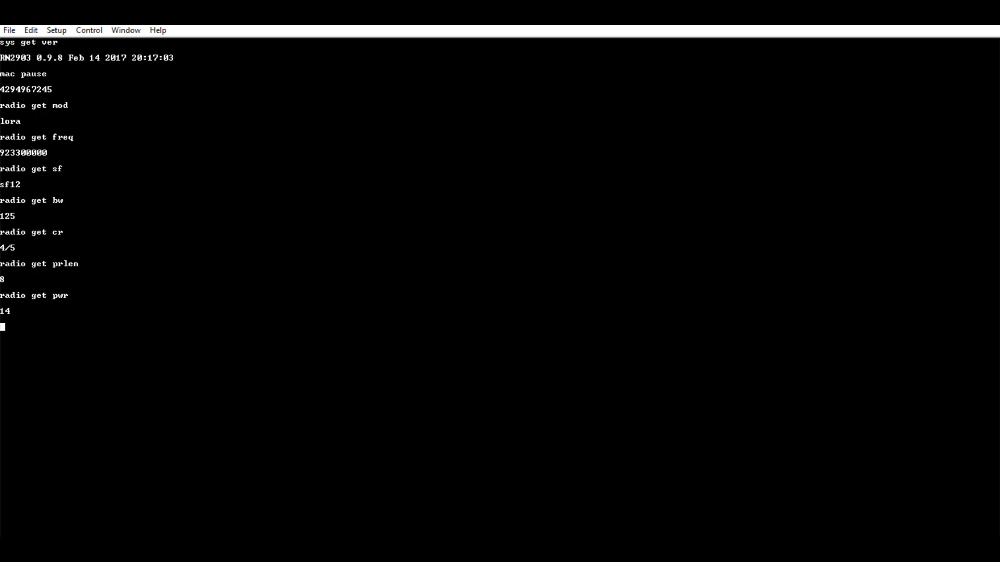

**Making the first communication ready for LORA**
=================================================

**Setting up serial port communication using TeraTerm**
+++++++++++++++++++++++++++++++++++++++++++++++++++++++

First we need to find out which serial port our rn2903a module is connected to. As we can see from the image below, rn2903a module is connected to COM3 serial port.

.. figure:: pic1.png
  :width: 800
  :align: center
  :height: 400
  :alt: Alternative text

  Finding the serial port to which rn2903 module is connected to

For communicating with the module, one can use TeraTerm or Putty. In this project TeraTerm will be used. Once you download the TeraTerm, a few changes need to be made to communicate with rn2903a module.
  
* **Click on setup->terminal**. The window above will open up.
  Here change Recieve to CR+LF, Transmit to CR+LF and also  enable Local echo. Click on OK. 
  The changes that need to be made can be seen in the image below:

  .. figure:: pic2.png
    :width: 800
    :align: center
    :height: 400
    :alt: Alternative text
 
    Changes to be made in Tera Term

* **Click on setup->serial port**. Here change the speed to 57600 bps. This can be seen in the     image below:

  .. figure:: pic3.png
    :width: 800
    :align: center
    :height: 400
    :alt: Alternative text

    Setting the baud rate in Tera Term

Now we can go ahead and start communicating with the module.
For communicating with the module, the default serial port setting is 57600 bps. Once set on your terminal, you can communicate with the module. The list of available command can be retrieved here.

There are 3 level of commands :

* **sys** for system command
* **mac** for LoRaWan protocol related command
* **radio** for low level radio transmission

**Commands to check RN2903 parameters**
+++++++++++++++++++++++++++++++++++++++

The different set of the commands are:

* **sys get ver** returns the firmware version, it is a good way to ensure the circuit works.
* **radio get mod** and **radio get freq**. These 2 first command indicates that the module is configured as LoRa device by default with a rx/tx frequency of 868.1Mhz.
* **radio get sf** -> The spread factor parameters defines the sensitivity of the reception, with a such value (sf12 is the more sensitive) the SNR can be up to -20dB. This also impacts the duration of  the transmission that becomes longer.
* **radio get bw** -> The used bandwidth determine time on air and sensitivity. With 125KHz the sensitivity is better but time on air is longer. Chip is capable from 125KHz to 500KHz. The time on air is doubled from 125KHz to 250KHz. 
  With a 125kHz bandwidth and a spread factor of 12, the time on air duration is about 1 second.
* **radio get cr** -> The CR (Coding rate) parameter determines an error correction mechanism by adding some information to the message. 4/5 is the best correction mechanism especially when the signal is low.
* **radio get prlen** -> The prlen gives the preamble length in symbol.
* **radio get pwr** -> Power level gives the power in dB of the transmitter ; values are from -3db to 15dB.

Now we can also change the power to 14dB to get more power and better link budget (this will consume 44mA/h and get 151dB as link budget)

* **radio set pwr 14** -> Sets the power to 14dB.
* **radio get pwr** -> Shows the power level.

The image below shows the execution of the above said commands on Teraterm and their corresponding outputs.

  Execution of commands on Tera Term

Next step is setting up the rn2903 library and playing with helper functions present in the **RN2903 library**. Please check out the next section of the documentation.

