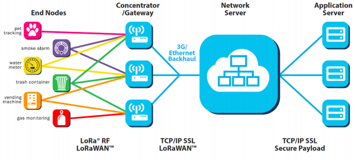

LoraWAN
=======

LoraWAN architecture
++++++++++++++++++++

  LoraWAN architecture

Classes of Lora
+++++++++++++++

* **Class A - Lowest power, bi-directional end-devices:**
  The default class which must be supported by all LoraWAN end-devices, class A communication is always initiated by the end-device and is fully asynchronous. Each uplink transmission can be sent at any time and is followed by two short downlink windows, giving the opportunity for bi-directional communication, or network control commands if needed. This is an ALOHA type of  protocol.
  The end-device is able to enter low-power sleep mode for as long as defined by its own application: there is no network requirement for periodic wake-ups. This makes class A the lowest power operating mode, while still allowing uplink communication at any time.
  Because downlink communication must always follow an uplink transmission with a schedule defined by the end-device application, downlink communication must be buffered at the network server until the next uplink event.

* **Class B – Bi-directional end-devices with deterministic downlink latency:**
  In addition to the class A initiated receive windows, class B devices are synchronised to the network using periodic beacons, and open downlink ‘ping slots’ at scheduled times. This provides the network the ability to send downlink communications with a deterministic latency, but at the expense of some additional power consumption in the end-device. The latency is programmable up to 128 seconds to suit different applications, and the additional power consumption is low enough to still be valid for battery powered applications.

* **Class C – Lowest latency, bi-directional end-devices:**
  In addition to the class A structure of uplink followed by two downlink windows, class C further reduces latency on the downlink by keeping the receiver of the end-device open at all times that the device is not transmitting (half duplex). Based on this, the network server can initiate a downlink transmission at any time on the assumption that the end-device receiver is open, so no latency. The compromise is the power drain of the receiver (up to ~50mW) and so class C is suitable for applications where continuous power is available.
  For battery powered devices, temporary mode switching between classes A & C is possible, and is useful for intermittent tasks such as firmware over-the-air updates.

LoraWAN Specification:
+++++++++++++++++++++++

* Standard:            LoRa WAN technology follows IEEE 802.15.4 standard

* Frequency:         License free ISM bands 433, 868, 915 MHz

* Bandwidth:         125 KHz, 250 KHz and 500 KHz

* Modulation:       Chirp spread spectrum based modulation (suitable for better sensitivity)

* Data rate:            Up to 50 kbps

* Range:                  Up to 20 KM

What is Lora Gateway?
+++++++++++++++++++++

Lora gateway is a sophisticated software architecture designed to carry out communication in Lora network terminology. It acts as a smart hub between end devices and application network server. In future, it will be preinstalled on all IoT enabled hardware to support wide range of applications.

Advantages of LoraWAN
++++++++++++++++++++++

* Long battery life for devices and sensors due to low power consumption
   
* Low cost implementation due to low cost hardware and unlicensed spectrum
    
* Long range coverage and in-building penetration

* Less complexity in programming
 
* Offers a secure transmission network
   
* Scalable network to support future upgrades
    
* Ease of access and connectivity to the cloud applications
    
* Remote management and control access
    
* Highly intelligent architecture

Future scope
++++++++++++

In future, our global, national and regional networks have to support billions or even trillions of devices. LoRa can play a significant role for providing a smart, low cost and highly efficient network for future applications. It has an association of more than 400 companies globally to contribute, improve and implement smart network for future needs.

