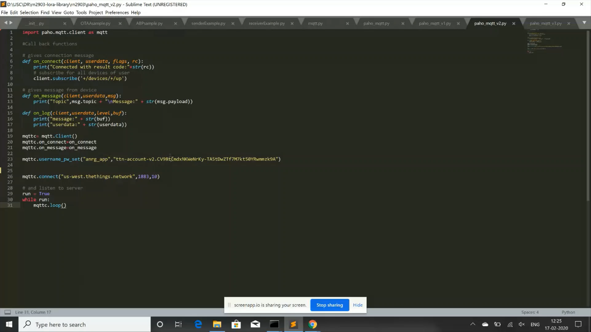
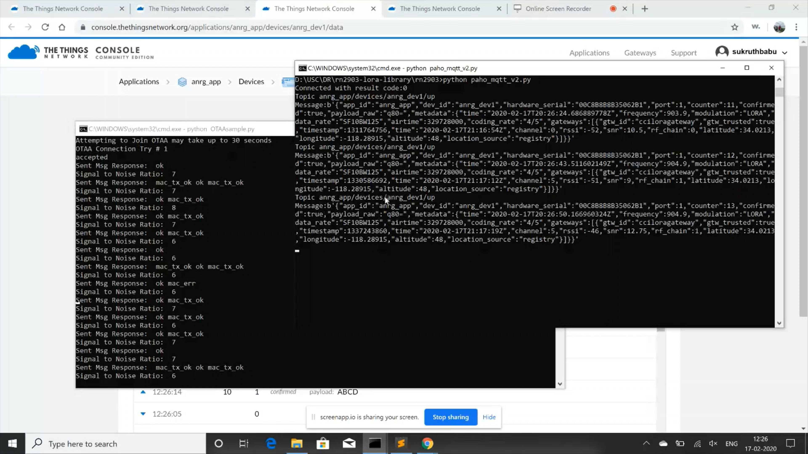

**MQTT Paho**
=============

**What is Paho**
++++++++++++++++

The Paho project provides scalable open-source implementations of open and standard messaging protocols aimed at new, exisiting, and emerging applications for Machine-to-Machine (M2M) and Internet of Things (IoT).

Paho reflects the inherent physical and cost contraints of device connectivity. Objectives include effective levels of decoupling between devices and applications, designed to keep markets open and encourage the rapid growth of scalable Web and Enterprise middleware and applications. Paho initially started with MQTT publish/subscribe client implementations for use on embedded platforms, and in the future will bring corresponding server support as determined by the community. 

**Installing Paho-MQTT Client**
+++++++++++++++++++++++++++++++

You can Install the MQTT client using PIP with the command:

**pip install paho-mqtt**

**Eclipse Paho MQTT Client script**
++++++++++++++++++++++++++++++++++++

The image below shows the mqtt paho client script. Using this the user would be able to get the data on his local instance. Therefore he would be able to save the sensor data if needed.

 
     MQTT Paho python script

Before running the script, a few things need to be changed in the script.

1. You need **change the arguments to the username_pw_set function**. **First argumen**t should be the **application name** that you chose on the Things Network. **Second argument** should be the **Access Key on the application** which you can get from the Things Network.

2. Then **change the arguments in the connect function**. The first argument should be the region to which you registered your device to on the Things Network.In my case, **"us-west.thethings.network"**. 

Now run the script using **python paho_mqtt_v2.py** command on the Windows terminal.

You can see the output on the Windows terminal. You can see the packets being sent and different parameters with which the packet was transmittes and received. 

The below image shows the **output of the paho_mqtt_v2 script**.

 
     Output of MQTT Paho python script

Thus we can observe the packet and network parameters using MQTT Paho.
