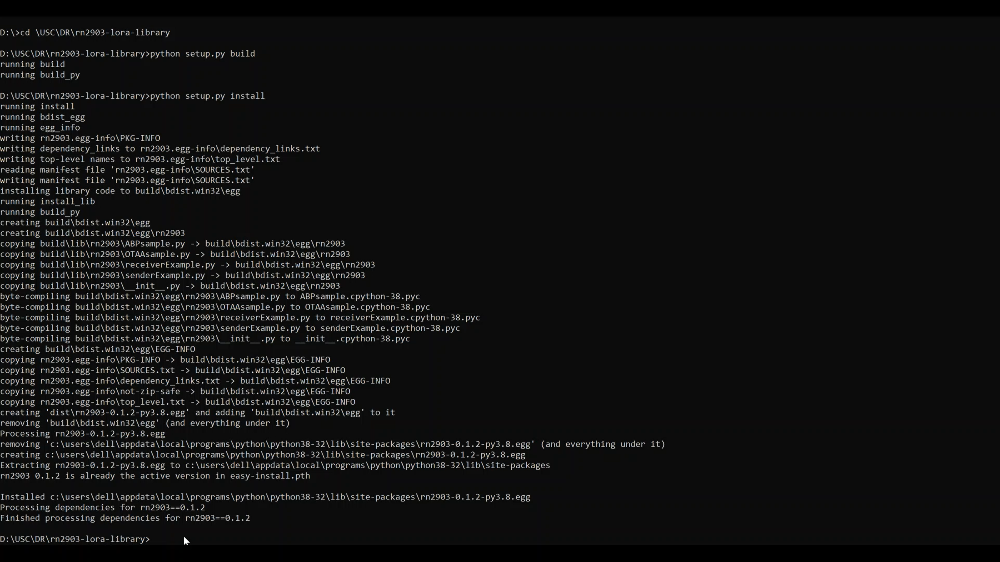
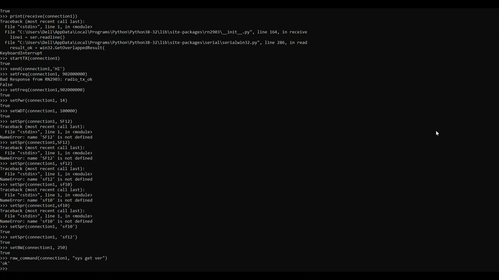

**RN2903 LIBRARY**
==================

**CREATING THE RN2903 PACKAGE AND INSTALLING IT**
+++++++++++++++++++++++++++++++++++++++++++++++++

* First we download the rn2903-lora-library file into our system.
* Then go ahead and create rn2903 folder inside rn2903-lora-library folder. 
* Transfer all the files in rn2903-lora-library(**except setup.py**) folder to rn2903 folder.
* Open the command prompt.
* Go to rn2903-lora-library folder using the **cd** command.
* Run **python setup.py build** command.
* Then go ahead and run **python setup.py install** command.
* The above two commands buids the **rn2903** package and installs it in your system.

The figure below illustrates this process.

**Testing different helper functions in rn2903 package**
++++++++++++++++++++++++++++++++++++++++++++++++++++++++

* **list_serial_ports**

  * **Description**:    
    Prints the names of the serial ports for user to connect to
    
  * **Input Arguments**:    
    None
    
  * **Return Arguments**:     
    List of all serial ports connected

  * **Usage**: 
    print(list_serial_ports())

* **open**

  * **Description**:
    Starts connection to the device at the serial port listed   
  
  * **Input Arguments**:
    Serial port name(as a string) 
   
  * **Return Arguments**:    
    Rn2903 Object(used for communicating later). You can name it anything you like

  * **Usage**: 
    connection1 = open('COM3')

* **status**

  * **Description**:    
    Checks if the device is connected returns result 
   
  * **Input Arguments**:    
    RN2903 Name 
   
  * **Return Arguments**:    
    None

  * **Usage**: 
    print(status(connection1))

* **startRX**

  * **Description**:    
    Sends all of the commands nessecary to set up the reciever with default values (radio pwr=14, watch dog timer=1 min). 
   
  * **Input Arguments**: 
    RN2903 Name  
  
  * **Return Arguments**: 
    True for success, false for failure

  * **Usage**: 
    startRX(connection1)

* **receive**

  * **Description**:   
    Recieves a message and returns it as a string
    
  * **Input Arguments**:    
    RN2903 Name    

  * **Return Arguments**:    
    Message received from sender(string) or error timeout 

  * **Usage**: print(receive(connection1))
 
* **startTX** 

  * **Description**:    
    Sends all of the commands necessary to set up the sender with default values

  * **Input Arguments**:    
    RN2903 Name  
  
  * **Return Arguments**:    
    True for success, false for failure

  * **Usage**: 
    startRX(connection1)

* **send**

  * **Description**:
    Sends a string to the reciever with a maximum of 44 characters  
   
  * **Input Arguments**:
    RN2903 Name, text(as a string)
    
  * **Return Arguments**:    
    True for success, false for failure

  * **Usage**: 
    receive(connection1, text to send as a string)

* **setFreq** 

  * **Description**:    
    Sets the frequency  
  
  * **Input Arguments**:   
    RN2903 decimal representing the frequency, from 902000000 to 928000000 in  Hz  
  
  * **Return Arguments**:    
    True for success, false for failure

  * **Usage**: 
    setFreq(connection1, 902000000)

* **setPower**

  * **Description**:   
    Sets the power for radio
    
  * **Input Arguments**:   
    RN2903 Name, signed decimal number representing the transceiver output power, from 2 to 20  
  
  * **Return Arguments**:    
    True for success, false for failure

  * **Usage**: 
    setPwr(connection1, 14)

* **setWDT** 
   
  * **Description**:  
    Sets the watchdog timer for reciever  
  
  * **Input Arguments**: 
    RN2903 Name, decimal number representing the time-out length for the Watchdog Timer, from 0 to 4294967295 in ms. Set to ‘0’ to disable this functionality    

  * **Return Arguments**: 
    True for success, false for failure

  * **Usage**: 
    setWDT(connection1, 100000)

* **setSpr**

  * **Description**:   
    Spreading Factor   
 
  * **Input Arguments**:    
    RN2903 Name, string representing the spreading factor. Parameter values can  be: sf7, sf8, sf9, sf10, sf11 or sf12   
 
  * **Return Arguments**:   
    True for success, false for failure

  * **Usage**: 
    setSpr(connection1, sf10)

* **setBW**  
 
  * **Description**: 
    Set Bandwidth  
  
  * **Input Arguments**:
    RN2903 Name, decimal representing the operating radio bandwidth in kHz.   Parameter values can be: 125, 250, 500 
   
  * **Return Arguments**:    
    True for success, false for failure

  * **Usage**: 
    setBW(connection1, 250)

* **raw_command** 
   
  * **Description**:   
    Type the exact commands from the reference manual. It will send the device the command and return the result 
   
  * **Input Arguments**:   
    RN2903 Name, command(as a string) 
   
  * **Return Arguments**:    
    String from rn2903 module

  * **Usage**: 
    raw_command(connection1, “sys get ver”)

**MAC Commands**
++++++++++++++++

* **joinABP**

  * **Description**: 
    Connects the device to the gateway using ABP

  * **Input Arguments**:
    Serial port name(as a string), device address, network session key application key

  * **Return Arguments**:    
    True for success, or error message

  * **Usage**: 
    joinABP(con,devAddr,nwkSKey,appSKey)

* **joinOTAA**

  * **Description**:    
    Connects the device to the gateway using OTAA

  * **Input Arguments**:
    Serial port name(as a string), appeui, appKey

  * **Return Arguments**:    
    True for success, or error message

  * **Usage**: 
    joinOTAA(con2, appEui, appKey)

* **Variables to Define**

  * **OTAA**:

    * appEui

    * appKey
 
  * **ABP**:

    * devAddr

    * nwkSKey

    * appSKey

The below image shows the execution of the above said helper functions and their outputs:

