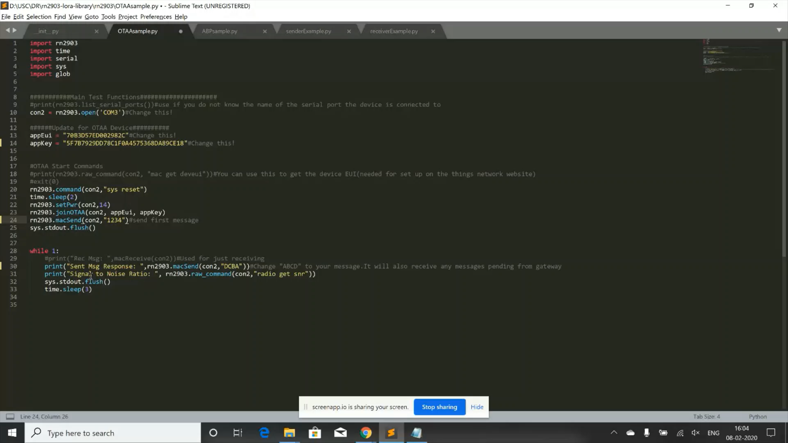

**Connecting RN2903a module to the Things Network**
===================================================

* Open a new terminal on Windows.

* Go to the directory where you have donwloaded the RN2903 code using the 'cd' command.

* A python script called OTAAsample.py is written to join to the Things Network using OTAA(Over the Air Activation)> You can see the script in the image below.

* In OTAAsample.py script, you need to change few things.

  * You need to **change the argument of the open funtion**. Change the argument to the serial port to which your RN2903 module is connected to. In my case, it is 'COM3'. You can find out to which port the RN2903 module is connected to by going to device manager and goings to ports section.

  * Then you need to change the appEUI and appKey. You can find this by going to your registered device page and going to the bottom of the page as you can see in the image below.
    .. image:: pic12.png
      :width: 800
      :align: center
      :height: 400
      :alt: Alternative text

* **What does OTAAsample.py script do?**
  

