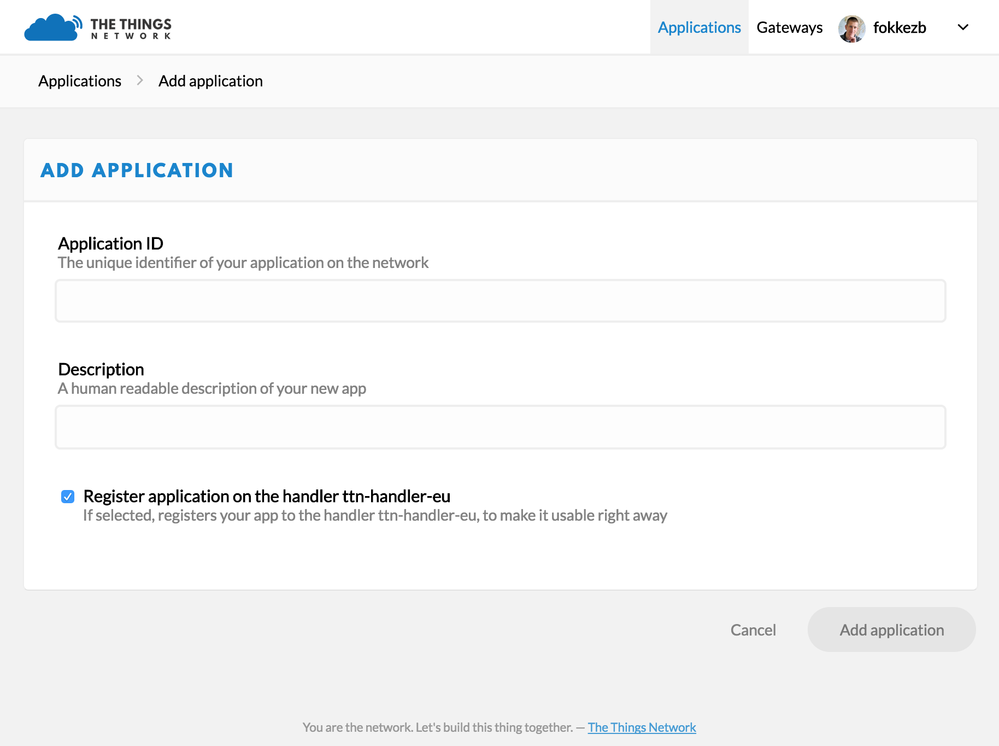
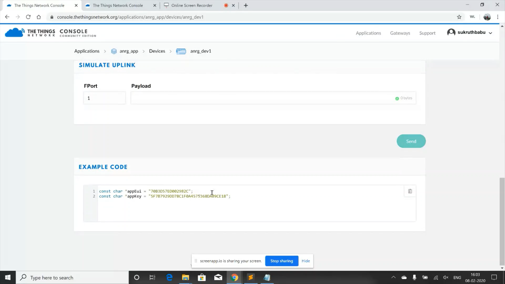

**Things Network**
==================

**Applications on Things Network**
++++++++++++++++++++++++++++++++++

* By Applications, we mean whatever it is your devices communicate with on the internet. This could be as simple as an IFTTT Maker Applet or a visual flow using Node-RED to custom code on some server.

* Before you can communicate with devices, you will need to add the application to the network and register devices to it.

* There are multiple options to integrate applications with The Things Network, ranging from working directly with APIs, via more friendly SDKs or click-and-run Platform Integrations.

**Building an application on Things Network**
+++++++++++++++++++++++++++++++++++++++++++++

Devices can communicate with applications that they’ve been registered to. To register a device, you’ll first need to add an application.

1. In the console, click add application.

* For Application ID, choose a unique ID of lower case, alphanumeric characters and nonconsecutive - and _.

* For Application Description, enter anything you like.

* Leave the checkbox enabled to automatically register the application to your default region.

2. Click Add Application to finish.

* You will be redirected to the newly added Application page where you can find the generated App EUI and Access Keys.

**From the screenshots below, you can see the application named anrg_app created by me and the application details.**

  anrg_app application creation

  anrg_app application details

**Devices on Things Network**
+++++++++++++++++++++++++++++

The Things Network is the first open source, decentralized infrastructure for the Internet of Things. The community edition is free for fair use. Learn how to connect your Things!

Before your device can communicate via The Things Network, you will need to register it.

Currently, The Things Network supports LoraWAN for long range (~5 to 15km), low power (months to years on battery), but also low bandwidth (51 bytes/message) communication. We plan to support multiple Bluetooth Broadcast/Mesh networks and other networks as well.

You can of course use The Things Node or Uno, but The Things Network supports any certified LoraWAN device. The ones you can find under Hardware have been tested and documented by us or our users.

**In our project we are using RN2903a module developed by Mirotechnology as our device.**

**Device Registration**
+++++++++++++++++++++++

Before a device can communicate via The Things Network you need to register it with an application
To use the default Over The Air Activation (OTAA) you will need to register your device with its Device EUI. See the documentation of your device for instructions, as for example that of The Things Uno.

1. Log in and open the Console.

2. if you don’t have an application yet, you need to create one. For more information on how to do this have a look a the Applications section.

3. Open the application to which you wish to add a device and click register device.
  
   * For Device ID, choose a - for this application - unique ID of lower case, alphanumeric characters and nonconsecutive - and _.

   * For Device EUI, copy-paste the one you retrieved from your device using the teraterm(see section 2). 

   * Leave the App Key to be generated..

   * For App EUI, select the generated EUI from the list.

     .. image:: pic8.png
       :width: 800
       :align: center
       :height: 400
       :alt: Alternative text

4. Click Register to finish.

You will be redirected to the newly registered device where you can find the generated App Key needed to activate the device.

**From the screenshots below, you can see the device anrg_dev1 created by me and its credentials. From the second screenshot you can see the appkey and appeui of the appplication to which this device is registered to.**

  anrg_dev1 device creation and its details

  appEUI and appKey of the application to which anrg_dev1 device is registered to

**Thus, I have created an application called anrg_app and registered a device called anrg_dev1 to this application.**

     
  

